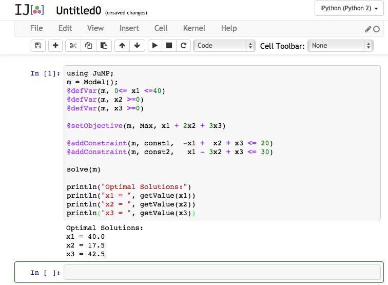

* TOC
{:toc}

This document was prepared to help anyone, especially those without great computing skills, install and start using the [Julia Language](http://julialang.org) for solving optimization problems. The syntax of Julia is very similar to MATLAB.

# Notes to Graduate Students

If you are a PhD student or an MS student who is interested in writing a thesis, I strongly recommend you to install Julia and Gurobi on your computer. If the operating system is too old on your machine to install Julia, you can use Julia on the web in JuliaBox for homework assignments. But for research, you should run your code locally on your computer.

# Using Julia in JuliaBox

You can enjoy many features of the Julia Language on the web at [http://juliabox.org](http://juliabox.org).  Log in with your Google account and create a "New Notebook”.

First, install the `Clp` and `JuMP` packages.

~~~ python
Pkg.add("Clp")
Pkg.add("JuMP")
~~~
and press `Shift+Enter` or click ▶ to run your code. `Clp` provides an open source LP solver, and `JuMP` provides a nice modeling interface.

Copy this code to your screen:

~~~ python
using JuMP
m = Model()
@defVar(m, 0<= x <=40)
@defVar(m, y <=0)
@defVar(m, z <=0)
@setObjective(m, Max, x + y + z)

@addConstraint(m, const1, -x +  y + z <= 20)
@addConstraint(m, const2,  x + 3y + z <= 30)

solve(m)
println("Optimal Solutions:")
println("x = ", getValue(x))
println("y = ", getValue(y))
println("z = ", getValue(z))
~~~

and press `Shift+Enter` or click ▶ to run your code. The result will look like:

If you want to use commercial solvers `CPLEX` or `Gurobi`, you have to install Julia in your computer. Please follow the instruction in the next section.

Also, check other examples below in this page. Especially the simple LP example and the MILP example.

# Installation Help

First, install Gurobi Optimizer. Gurobi is a commercial optimization solver package for solving LP, MILP, QP, MIQP, etc, and it is free for academics.

1. [Download Gurobi Optimizer](http://user.gurobi.com/download/gurobi-optimizer) and install in your computer. (You will need to register as an academic user.)
2. [Request a free academic license](http://user.gurobi.com/download/licenses/free-academic) and follow their instruction to activate it.

(Note to **Windows** users: The version you select, either 32-bit or 64-bit, needs to be consistent. That is, if you choose 64-bit Gurobi Optimizer, you will need to install 64-bit Julia in the next step. After installation, you must **reboot** your computer.)

Now, install Julia. These two documents provide steps with screenshots to install the Julia Language, the JuMP package, and the Gurobi package.

- [Install Guide for **Windows**](julia_install_windows)
- [Install Guide for **Mac OS X**](julia_install_mac)

Read also the JuliaOpt page. When you are ready, there are basically two methods to run your Julia script:

- In your Command Prompt or Terminal, enter `C:> julia your-script.jl`
- In your Julia prompt, enter `julia> include("your-script.jl")`
You will observe the second method is faster, when you run the script multiple times. We hope that the next version of Julia can improve this.

# Examples

The purpose of the example codes below is simply to illustrate how one could use Julia for optimization. The efficiency of the codes has not been considered.

- A very simple LP example:
  - [LP1.jl](codes/LP1.jl)
- A very simple MILP example:
  - [MILP1.jl](codes/MILP1.jl)
- Solving shortest-path problems by Dijkstra’s algorithm via the [`Graphs` package](http://graphsjl-docs.readthedocs.org/en/latest/):
  - [dijkstra.jl](codes/dijkstra.jl)
  - [network-data.csv](codes/network-data.csv)
- Solving shortest-path problems by linear programming:
  - [shortest-path-lp.jl](codes/shortest-path-lp.jl)
  - [network-data.csv](codes/network-data.csv)

# Using the Gurobi Optimizer

*If you have followed the installation guide above, you don’t need to install Gurobi again.*

Gurobi is a commercial optimization solver package for solving LP, MILP, QP, MIQP, etc, and it is free for academics. JuMP supports an interface with Gurobi via [`Gurobi.jl`](https://github.com/JuliaOpt/Gurobi.jl). Here is an instruction:

1. [Download Gurobi Optimizer](http://user.gurobi.com/download/gurobi-optimizer) and install in your computer. (You will need to register as an academic user.)
2. [Request a free academic license](http://user.gurobi.com/download/licenses/free-academic) and follow their instruction to activate it.
3. Install the Gurobi.jl package. In your Julia prompt, enter: `julia> Pkg.add("Gurobi")`
Ready. Test the following codes

~~~ python
using JuMP, Gurobi
m = Model(solver=GurobiSolver())
@defVar(m, x <= 5)
@defVar(m, y >= 45)
@setObjective(m, Min, x + y)
@addConstraint(m, 50x + 24y <= 2400)
@addConstraint(m, 30x + 33y <= 2100)

status = solve(m)
println("Optimal objective: ", getObjectiveValue(m))
println("x = ", getValue(x), " y = ", getValue(y))
~~~

# Using the CPLEX Optimizer

You can similarly install and connect CPLEX solvers via the [`CPLEX.jl`](https://github.com/joehuchette/CPLEX.jl) package, which can require some troubleshooting. Follow [this instruction](http://stom.chkwon.net/cplex/) to install CPLEX. I recommend Gurobi for most people.

**Mac Users**: to add the CPLEX package to Julia, follow:

* Add the following line to your `~/.bash_profile` file: (change [YOUR USER NAME])

~~~ bash
export LD_LIBRARY_PATH="/Users/[YOUR USER NAME]/Applications/IBM/ILOG/CPLEX_Studio126/cplex/bin/x86-64_osx/":$LD_LIBRARY_PATH
~~~

* Reload your profile:

~~~ bash
source ~/.bash_profile
~~~

* Run julia and add the CPLEX package:

~~~ python
julia> Pkg.add("CPLEX")
~~~

* Ready. Test the following code:

~~~ python
using JuMP, CPLEX
m = Model(solver=CplexSolver())
@defVar(m, x <= 5)
@defVar(m, y <= 45)
@setObjective(m, Min, x + y)
@addConstraint(m, 50x + 24y <= 2400)
@addConstraint(m, 30x + 33y <= 2100)

status = solve(m)
println("Optimal objective: ",getObjectiveValue(m))
println("x = ", getValue(x), " y = ", getValue(y))
~~~

# Teach Yourself Julia

- [Learn Julia in Y minutes](http://learnxinyminutes.com/docs/julia/) - This will help you figure out how Julia works.
- [Julia By Example](http://www.scolvin.com/juliabyexample/) – This provides many useful examples for common tasks including plotting and data manipulation.
- [Julia Documentation](http://docs.julialang.org/) – The official Julia documentation.
- [What's wrong with this Julia?](http://www.slideshare.net/KentaSato/whats-wrong-47403774) - Important lessons for performance optimization

# Relevant Packages

- [MathProgBase.jl](http://mathprogbasejl.readthedocs.org/en/latest/) – linprog, mixintprog, quadprog, etc.
- [Optim.jl](https://github.com/JuliaOpt/Optim.jl/blob/master/README.md) – gradient descent, Newton’s method, BFGS, conjugate gradient, golden section search, etc.
- [JuMP.jl](https://jump.readthedocs.org/en/latest/) – Julia for Mathematical Programming provides algebraic modeling languages.
- [Graphs.jl](http://graphsjl-docs.readthedocs.org/en/latest/) – shortest paths, minimum spanning tree, etc

# [Plotting in Julia](plotting)
