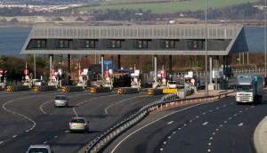
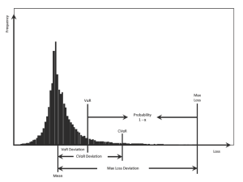

<em>(under construction)</em>
<h1>Research Focus Areas</h1>
<h2>Hazardous Materials Transportation Regulation</h2>

It is desirable to avoid extremely high hazmat accident consequences at any cost regardless of how the risk is measured. In hazmat transportation, a risk scenario corresponds to each arc, and specific scenarios can be completely avoided by not traveling the corresponding road arcs. This avoidance can be done by prohibiting hazmat trucks from traveling through those arcs. From this perspective, governments often enforces interventions to control hazmat travel. Curfews, which are time-based bans on road segments, is its first kind. To pose curfews as an optimization problem we allow a percentage of the road segments to be impacted for certain time periods. The goal, then, is to determine which road segments should be selected for curfew imposition at what specific time periods, so that the solution of the multi-trip hazmat problem, in which each hazmat shipment is individually optimized by the shippers, is also one that satisfies an acceptable level of equity. The second intervention method of our interest is that of using road bans. This is an extreme case of a curfew, in which a percentage of road segments are shut off to hazmat traffic at all times.

A more sophisticated method of controlling hazmat traffic flow is to guide the behavior of hazmat shippers through the use of tolls. The fundamental premise of this approach is that shippers will optimize a certain combination of the travel cost, toll cost, and risk. Thus, setting tolls judiciously on road segments can create the desired flow of hazmat traffic. It is possible that a different set of toll is imposed for regular traffic; we call such a toll system a dual-toll system. A dual-toll system may create a safer hazmat network flow than a single-toll system. The <a href="http://hazmat.chkwon.net" target="_blank">dual-toll project</a> has been supported by NSF.
<h2>Risk Measures for Hazardous Materials Routing</h2>

When we determine routes for transporting hazardous materials (hazmat), we must consider risk of accidents and hazmat release. Various measures of such risk have been suggested and used; but many of them are inappropriate for risk-averse routing and lack flexibility. In this focus area, we seek development of risk-averse, flexible, and robust routing methods based on advanced risk measures such as Value-at-Risk (VaR), Conditional Value-at-Risk (CVaR), and Spectral Risk Measures.

&nbsp;
<h2>Post-Disaster Supply Chain Disruption Management</h2>
<h2>Efficient Management of Shared Mobility Systems</h2>
<h2>Electric Vehicles Recharging Problems</h2>
<h1>Publications</h1>
See <a href="http://www.chkwon.net/research/#Publications" target="_blank">this list of publications</a>.

&nbsp;
